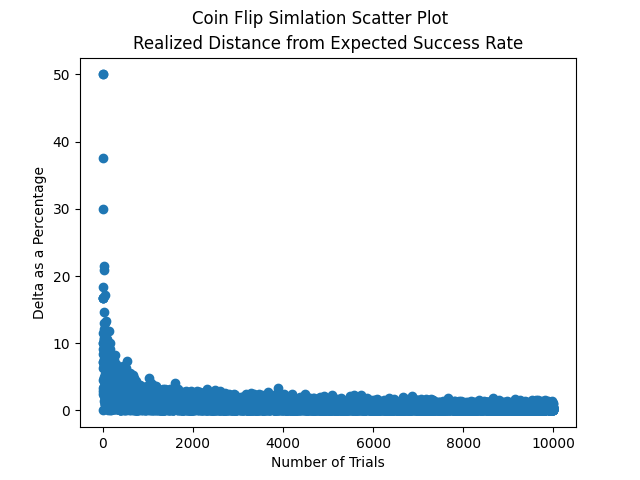
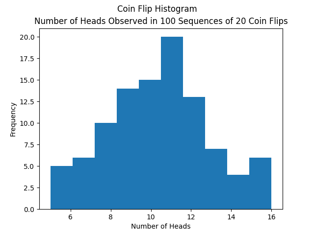

# Coin Flip Simulation
## Summary
I wrote a simple script that simulates a fair coin being fliped and compared the expected success rate to the realized success rate. I was interested in packaging the trial outcomes from experiment into bytearrays and I provided a final visualization to validate the expected limiting behavior of the simulation as the number of trials increases.

6/13/2023: I added an additional simulation that was requested by a friend. The ask was to plot a histogram which would count the coin flips in a sequence of 100 expirements consisting of 20 coin flips. This required some minor refactoring and some mapping and filtering on the outcomes. The outcome appears close to a normal distribution.

## Methodolgy
- Each experiment follows a binomial distribution since a coin toss can be measured as a discrete outcome. Additionally, each coin toss is independent from one another and generated from a uniform distribution. Outcomes above the theoretical success rate are considered a success.
- I encoded each sequence of trial outcomes into bytearray objects and then counted the success rate for each experiment.
- Since the expected number of successes is equal to the number of trials multiplied by the theoretical success rate, the realized success rate is therefore equal to the number of observed success divided by the total number of trials.
- Once this was completed, I packaged this information into the below visualization.

## Formulas
* **Mean of the Binomial Distribution:**
  - $\mu = {Number\ of\ Trials}\cdot {Theoretical\ Success\ Rate}$

* **Realized Success Rate:**
  - ${Realized\ Success\ Rate} = \frac{Number\  of\ Successes}{Number\ of\ Trials}$

* **Distance between the Theoretical and Realized Success Rates:**
  - $\Delta = \vert{\mu - Realized\ Success\ Rate}\vert$

## Output
### Simulation 1

### Simulation 2

